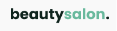
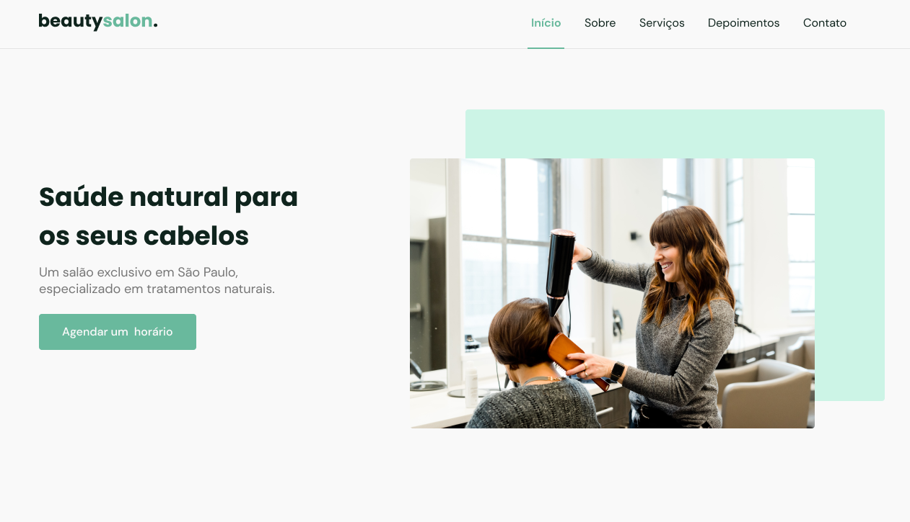

# \<nlw/\>together - [Rocketseat](https://rocketseat.com.br/)
## Next Level Week 6 - Trilha Origin

- Educador Rocketseat: Mayk Brito

----

<h1 align="center">
  
</h1>

  <a href="#-tecnologias">Tecnologias</a>&nbsp;&nbsp;&nbsp;|&nbsp;&nbsp;&nbsp;
  <a href="#-projeto">Projeto</a>&nbsp;&nbsp;&nbsp;|&nbsp;&nbsp;&nbsp;
  <a href="#-layout">Layout</a>&nbsp;&nbsp;&nbsp;|&nbsp;&nbsp;&nbsp;
  <a href="#-material">Material</a>&nbsp;&nbsp;&nbsp;|&nbsp;&nbsp;&nbsp;
  <a href="#-assuntos-abordados">Assuntos abordados</a>&nbsp;&nbsp;&nbsp;|&nbsp;&nbsp;&nbsp;
  <a href="#%EF%B8%8F-guia-de-estudos-e-organização">Guia de estudos e organização</a>&nbsp;&nbsp;&nbsp;|&nbsp;&nbsp;&nbsp;
  <a href="#-licença">Licença</a>

  

## 🚀 Tecnologias

Esse projeto foi desenvolvido com as seguintes tecnologias:

- HTML (Responsive Web Design)
- CSS
- JavaScript
- Swiperjs
- scrollRevealjs
  
## 💻 Projeto

O Beautysalon é um site de um salão de beleza desenvolvido com o conceito de mobile first, com uma seção utilizando slider e animação de elementos conforme eles entram ou saem da janela de visualização (viewport).

## 🔖 Layout

Você pode visualizar o layout do projeto através do [Figma](https://www.figma.com/file/cccwr6dfpk9uxXNmcKY0bn/Origin-Six). É necessário ter conta no [Figma](https://figma.com) para acessá-lo e interagir.

## 📓 Material

Material para o projeto e configuração do ambiente no [Notion](https://www.notion.so/NLW6-Trilha-Origin-64d5e195f89945b9b15e7554dbff0127)

## 📝 Assuntos abordados

### 🏁 Aula 1 - O começo de tudo

### Fundamentos WEB

- Programação WEB
  - O que é programação?
    - Ensinar computador
      - Algoritmos
        - [x]  Passo a passo
        - [x]  Conjunto de Regras
      -Lógica de Programação
        - [x]  Maneira de Pensar
      -Sintaxe
        - [x]  Maneira correta de escrever
    - Linguagem de programação
      - Javascript
  
- Front-end e Back-end
  - Comunicação
    - Cliente chama
    - Servidor escuta e responde
  - Como é feita essa comunicação?
    - HTTP (HyperText Transfer Protocol)
    - URL (Universal Resource Location)
    - Troca de dados
  - Tecnologias do Front-end
    - HTML
    - CSS
    - Javascript

### Introdução às tecnologias

- HTML
  - O que é?
  - Tags e Anatomia
  - Aninhamento
  - Exemplo de código

- CSS
  - O que é?
    - Cascading Style Sheets
    - Apresentação visual para o cliente
    - Estilo para o HTML
  - Seletores e anatomia
  - Exemplo de código
  - Cascading
  - Specificity
  - Responsivo
  - Box Model
  - Layout
  
- Javascript
  - Tipos de dados
    - String
    - Number
    - Boolean
  - Variáveis
    - const
    - let
  - Objetos
    - conjunto de atributos e funcionalidades
  - Funções
    - cria sequencia de passos da aplicação
    - executa a sequencia
  - Condições
    - (if) se algo for verdadeiro, faz alguma coisa
    - se for false (else) faz outra coisa
  - Repetições (loop)
    - for
  
### 👨‍🎓 Aula 2: Expandindo o conhecimento

### Etapas

- Estrutura do menu
- Pack de ícones
- Menu mobile
  - Abrir ao clicar no ícone
  - Tela cheia
  - Esconder ao clicar
- Section
  - Sobre
    - Imagem
    - Texto
  - Serviços
    - Cards
- Rolagem suave
- Header scroll

### 🎛️ Aula 3: Novos controles

- Depoimentos
  - Estrutura HTML
  - Fotos dos users
  - Estilizar a seção
  - Biblioteca Swiper
- Contato
  - Estrutura HTML
  - Estilo
  - Enviar mensagem via whats
  
- Animação quando rolar a página (scrollreveal)

### 🔬 Aula 4: Aprofundando os conceitos

- Rodapé
  - Estrutura HTML
  - Redes sociais
  - Estilizar
- Voltar para cima
  - Estrutura HTML
  - Estilo
  - Criar lógica
- Intro Media Queries
  - Responsivo

### 🔚 Aula 05: Finalizando o projeto

- Media Queries
  - Responsivo
  - Menu
  - Home
  - About
  - Services
  - Testimonials
    - Ajustes JS
  - Contact
  - Footer
    - social com grid
  - bugfix
  - Link ativo
  
## 🗂️ Guia de estudos e organização

- Aprendizado ativo x passivo
  - Aprenda a se perguntar: Se pergunte o que você acabou de ver
  - Aprenda a ensinar: Repita o que você acabou de ver.
- Anotação e Revisão
  - Anote mais após a aula
  - Revise suas anotações e busque respostas para o que você não entendeu

## 📝 Licença

Esse projeto está sob a licença MIT. Veja o arquivo [LICENSE](LICENSE) para mais detalhes.

  
  

